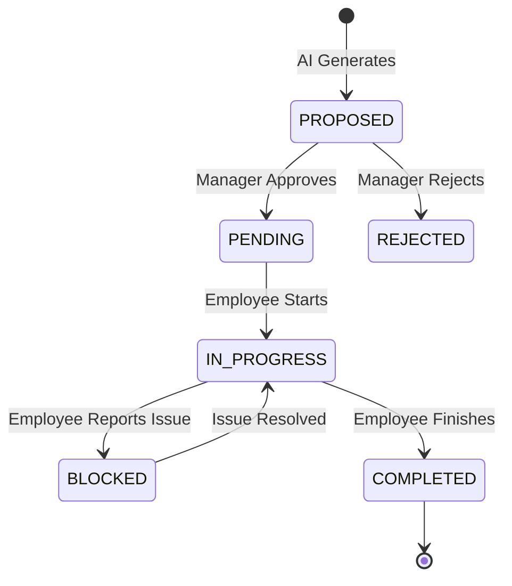

# UX & Product Flow Design: useAxiom

## 1. Product Navigation Structure
### 1.1 Global Navigation
- **Organization Admin:** `[Dashboard] [Users] [Billing] [Integrations] [Settings]`
- **Manager:** `[Dashboard] [Projects] [Team Workload] [AI Chat / Assistant] [Settings]`
- **Employee:** *(No Dashboard. Interaction strictly via WhatsApp)*

### 1.2 Hierarchy
- **Dashboard (Manager):** Overview metrics -> High-level project statuses -> Action items (Pending Approvals).
- **Projects:** Project List -> Project Detail -> Milestones -> Tasks -> Task Detail.
- **AI Assistant:** Global slide-out panel accessible from any Manager screen.

## 2. Complete User Journeys
### 2.1 Organization Admin Journey
1. **Sign Up:** Enters email, creates organization profile.
2. **Integration:** Connects Meta WhatsApp Business API using a QR/OAuth flow.
3. **Onboarding Users:** Uploads a CSV or inputs phone numbers/emails for Managers and Employees.
4. **Maintenance:** Periodically reviews billing and global automation settings (e.g., enabling "Autonomous" mode).

### 2.2 Manager Journey
1. **Onboarding:** Receives email invite, sets password, lands on an empty dashboard with a prompt from the AI: "Let's create your first project."
2. **Project Creation:** Types a paragraph describing the objective.
3. **Review & Approve:** Reviews the AI-generated task list, tweaks assignments, clicks "Approve Plan".
4. **Monitoring:** Checks dashboard daily to see green/yellow/red indicators based on AI analysis of employee WhatsApp chats.
5. **Intervention:** Chats with the AI to resolve a blocked task (e.g., "Reassign Task 3 to Sarah").

### 2.3 Employee Journey
1. **Onboarding:** Receives an automated WhatsApp message: "Hi! I'm Axiom, your AI execution assistant. I'll be sending you your daily tasks here."
2. **Daily Execution:** Receives a 9 AM summary of the day's tasks.
3. **Status Update:** Replies natively (e.g., "Done with the logo", "Stuck on the API").
4. **Completion:** Receives a congratulatory message and the next queued task.

### 2.4 AI Agent Journey
1. **Listener:** Constantly monitors the PostgreSQL queue for new Manager inputs or incoming WhatsApp webhooks.
2. **Planner:** Deconstructs Manager goals into atomic tasks and assigns resources.
3. **Communicator:** Formats natural language messages to employees.
4. **Analyzer:** Parses incoming employee text, maps it to a database state change (e.g., `STATUS = BLOCKED`), and updates the Manager UI.

## 3. End-to-End Product Flows
### 3.1 Project Planning & AI Task Generation
1. Manager clicks "New Project".
2. UI presents a single text area: "Describe what we need to achieve."
3. Manager types goal -> hits Enter.
4. Loading state: "AI is analyzing resources and generating a plan..."
5. UI transitions to "Draft Plan" view showing Milestones and Tasks.
6. Manager adjusts an assignee from a dropdown -> clicks "Approve & Start Execution".
7. System transitions tasks from `PROPOSED` to `PENDING` and schedules employee notifications.

### 3.2 Employee Updates & Task Completion
1. AI schedules and sends a WhatsApp message: "Ready to start the API endpoint task?"
2. Employee replies: "Just finished it."
3. Webhook received -> AI parses intent as `COMPLETED`.
4. AI replies to Employee: "Great job! I've marked it done. Next up is the DB migration."
5. Manager Dashboard instantly updates the task progress bar and marks the task as complete.

## 4. Manager Dashboard Screen Inventory
### 4.1 Login / Auth Screen
- **Purpose:** Secure entry.
- **Actions:** Login, Forgot Password.
- **States:** Loading spinner on submit, Error toast on invalid credentials.

### 4.2 Home Dashboard
- **Purpose:** High-level overview of execution health.
- **Features:** "Pending Approvals" widget, "At Risk" projects widget, Team workload graph.
- **Empty State:** "You have no active projects. Create one to get started."

### 4.3 Project List View
- **Purpose:** View all projects.
- **Features:** Search, filter by status. List showing Name, Progress Bar, AI Health Score.

### 4.4 Project Detail View
- **Purpose:** Deep dive into a project's execution.
- **Features:** Milestone list, Task cards, Assignee avatars, Status badges.
- **Actions:** Edit task, Reassign, Delete, Chat with AI about this project.

### 4.5 AI Chat Panel (Slide-out)
- **Purpose:** Conversational interface for management.
- **Features:** Chat history, predefined suggestion chips ("Why is this delayed?").

## 5. Low-Fidelity Wireframes (Text-Based)
### 5.1 Project Detail Screen
```text
================================================================================
[Logo]   Dashboard   Projects   Team                      [AI Chat] [Profile]
================================================================================
Project: Q3 Marketing Launch 
Status: [ACTIVE]   Health: [🟢 On Track]   Progress: [======----] 60%
--------------------------------------------------------------------------------
[ + Add Task ]  [ Ask AI for Insights ]
--------------------------------------------------------------------------------
Milestone 1: Asset Creation (Completed)
Milestone 2: Campaign Setup (In Progress)
  - Task 1: Draft Email Copy     | Assignee: Dave  | Status: [DONE]
  - Task 2: Configure Audience   | Assignee: Sarah | Status: [IN PROGRESS]
  - Task 3: Load Graphics        | Assignee: Dave  | Status: [BLOCKED] ⚠️
--------------------------------------------------------------------------------
```

## 6. WhatsApp Experience (Conversational Design)
### 6.1 Morning Summary
> **AI:** "Good morning Alex! ☀️ You have 2 tasks queued for today for the 'Q3 Marketing Launch' project:
> 1. Configure Audience (Est: 2hrs)
> 2. Load Graphics (Est: 1hr)
> Ready to start #1?"
> **Employee:** "Yes starting now"
> **AI:** "Perfect. I'll update the board. Let me know when you're done or if you get blocked!"

### 6.2 Blocked Conversation
> **Employee:** "I can't load the graphics, the drive link is broken."
> **AI:** "Got it. I've marked 'Load Graphics' as BLOCKED and notified David to get you the right link. Do you want to move on to 'Draft Email Copy' in the meantime?"
> **Employee:** "Yeah I'll do that"
> **AI:** "Done. Your active task is now 'Draft Email Copy'."

## 7. AI Conversation Design (Dashboard)
**Scenario:** Manager interacting with AI panel.
- **Manager:** "Why is Milestone 2 delayed?"
- **AI:** "Dave reported a blocker on 'Load Graphics' at 10:15 AM because the Google Drive link is broken. Sarah is also running behind on 'Configure Audience'. Would you like me to ping Sarah for an update?"
- **Manager:** "Yes, ping Sarah. And tell Dave I'll fix the link in 5 mins."
- **AI:** "Done. I've routed those messages via WhatsApp."

## 8. AI Internal Workflow
1. **Task Generation:** AI receives the objective -> uses a system prompt optimized for breakdown -> validates JSON output against schema -> proposes to Manager.
2. **Progress Monitoring:** A cron job runs every hour -> AI evaluates (Time Elapsed vs Estimated Time) -> If threshold exceeded, AI flags task as "At Risk".
3. **Intent Classification:** Webhook receives text -> AI evaluates text against enum `[COMPLETED, BLOCKED, DELAYED, STARTING, QUESTION]` -> Executes DB state change via internal API.

## 9. State Transition Diagrams

### 9.1 Task Lifecycle


## 10. Exception Flows
- **Employee on Leave / Unavailable:** If AI detects an Out of Office intent, it automatically prompts the Manager in the dashboard to reassign their active tasks.
- **WhatsApp Delivery Failure:** If Meta returns a 400/500 error, the AI flags the employee with a "Connectivity Warning" on the Manager's dashboard.
- **AI Confidence Too Low:** If the employee sends a complex/vague message ("I don't know what's going on tbh"), the AI sets intent to `REQUIRES_HUMAN_INTERVENTION` and forwards the exact message to the Manager Dashboard.

## 11. Automation Mode UX
- **Manual:** Manager clicks buttons to assign tasks. AI chat is strictly reactive (Q&A).
- **AI Assisted (MVP):** AI drafts plans and suggests assignments. Badges read "Awaiting Manager Approval".
- **Autonomous (Future):** Tasks go straight from `PROPOSED` to `PENDING`. UI highlights a feed of "Decisions made by AI today" for the Manager to review retroactively.

## 12. Notifications Matrix

| Notification | Recipient | Trigger | Channel | Priority |
| :--- | :--- | :--- | :--- | :--- |
| Daily Plan | Employee | 9:00 AM local time | WhatsApp | Medium |
| Blocker Alert | Manager | Employee reports block | Dashboard / Email | High |
| Task Approval Needed | Manager | AI generates new plan | Dashboard | Medium |
| Approaching Deadline | Employee | 2 hrs before deadline | WhatsApp | High |

## 13. Permissions Matrix

| Capability | Org Admin | Manager | Employee |
| :--- | :--- | :--- | :--- |
| Config WhatsApp API | Yes | No | No |
| Change Billing | Yes | No | No |
| Create Projects | Yes | Yes | No |
| Approve AI Tasks | Yes | Yes | No |
| View Dashboards | Yes | Yes | No |
| Update Task via Text | No | No | Yes |

## 14. UX Principles
1. **Conversation-First:** Minimize buttons and forms. If a natural language query can achieve the result, prefer it.
2. **Minimal Cognitive Load:** Managers should only see what requires their attention (Blockers, Pending Approvals). Hide smooth-running operations.
3. **Forgiving AI:** The AI must always allow the Manager to override its decisions or correct its intent parsing.

## 15. Future UX Opportunities
- **Slack/Teams Integration:** Expanding the Conversational Gateway beyond WhatsApp for desk-based employees.
- **Voice Interactions:** Allowing employees to send WhatsApp Voice Notes, which the AI transcribes and parses for intent.
- **AI Standups:** The AI compiles all employee updates and generates a 1-minute daily podcast/audio summary for the Manager.
