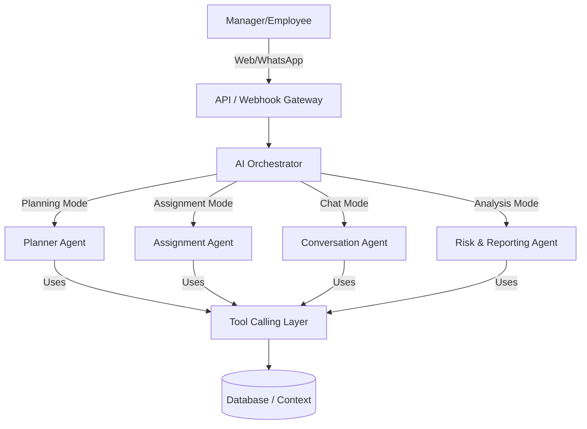

# AI Agent Design Document (ADD): useAxiom

## 1. Introduction
This document defines the architecture, strategy, and boundaries of the AI layer powering **useAxiom**. Unlike traditional chat bots, useAxiom acts as an autonomous execution engine that plans, delegates, monitors, and intervenes. This document serves as the definitive blueprint for implementing this AI intelligence.

## 2. Overall AI Architecture
useAxiom will employ a **Hierarchical Multi-Agent Architecture**.
Instead of relying on a single monolithic LLM prompt to handle all edge cases, the system utilizes an **AI Orchestrator** that routes requests and context to specialized **Sub-Agents**. This limits the scope of any single LLM invocation, improving accuracy, reducing hallucinations, and lowering latency.

## 3. Sub-Agent Definitions & Responsibilities

### 3.1 AI Orchestrator (The Router)
- **Responsibility:** Acts as the entry point for all AI interactions. It analyzes incoming triggers (a manager submitting a project goal, or an employee sending a WhatsApp message) and routes the request to the appropriate Sub-Agent.
- **Inputs:** Event triggers, Raw text.
- **Outputs:** Routing instruction to a specific Sub-Agent.

### 3.2 Planner Agent
- **Responsibility:** Deconstructs high-level manager objectives into granular, executable milestones and tasks.
- **Inputs:** Project objective, desired deadline, historical project templates.
- **Outputs:** A structured JSON object containing Milestones, Tasks, and estimated effort hours.
- **Tool Access:** `get_historical_projects()`, `validate_task_schema()`

### 3.3 Assignment & Scheduler Agent
- **Responsibility:** Maps tasks to the best-suited employees based on workload, skills, and past performance. Generates daily schedules.
- **Inputs:** Generated task list, employee profiles, active workloads, calendar data.
- **Outputs:** Assignment recommendations (Task ID -> Employee ID).
- **Tool Access:** `get_employee_workloads()`, `get_employee_skills()`

### 3.4 Conversation Agent (WhatsApp parser)
- **Responsibility:** Interprets natural language updates from employees via WhatsApp and maps them to system actions.
- **Inputs:** Employee WhatsApp message, Employee's active tasks, Short-term chat history.
- **Outputs:** Intent classification (`COMPLETED`, `BLOCKED`, `DELAYED`, `QUESTION`), structured data payload, and a natural language reply.
- **Tool Access:** `update_task_status()`, `send_whatsapp_message()`

### 3.5 Risk & Reporting Agent
- **Responsibility:** Operates asynchronously via CRON jobs to analyze execution velocity, detect blockers, and formulate alerts for the Manager Dashboard.
- **Inputs:** Project timelines, Task status changes, Employee updates.
- **Outputs:** Risk score (0-100), Alert payloads.
- **Tool Access:** `flag_project_at_risk()`, `create_manager_notification()`

## 4. Context Engineering & RAG Strategy
To prevent hallucination and provide accurate answers, the AI relies on dynamically retrieved context.
- **RAG (Retrieval-Augmented Generation):** The system will embed past successful project plans and task estimations into a vector database. When the Planner Agent receives a new objective, it retrieves semantically similar past projects to baseline its estimations and task breakdowns.
- **Just-In-Time Context:** When parsing a WhatsApp message, the Conversation Agent receives the employee's name, their currently active tasks, and the last 5 messages. It *does not* receive the entire project history, keeping the prompt focused and fast.

## 5. Memory Model
### 5.1 Short-Term Memory (Session)
Used primarily by the Conversation Agent. It maintains a sliding window of the last 10 interactions (Dashboard or WhatsApp) to handle conversational continuity (e.g., Employee: "I'm stuck on it" -> AI needs to know "it" refers to Task #3).
### 5.2 Long-Term Memory (Semantic)
Used by the Planner and Assignment agents. 
- **Employee Profiles:** The AI continuously updates an internal profile of employee velocity (e.g., "Alex completes API tasks 20% faster than estimated").
- **Project Knowledge:** Finalized projects are stored as reference material for future planning.

## 6. Tool-Calling Architecture
Agents do not directly mutate the database. They output structured Tool Calls (e.g., OpenAI Function Calling).
- The Backend parses the Tool Call.
- The Backend validates permissions (Can this AI agent modify this task?).
- The Backend executes the SQL update.
- The Backend returns the result to the AI Agent.

## 7. Confidence Scoring & Escalation Rules
Every AI decision (especially intent classification by the Conversation Agent) generates a Confidence Score (0.0 - 1.0).
- **Score > 0.85:** The AI automatically executes the tool call (e.g., Marks task as Done).
- **Score 0.50 - 0.84:** The AI asks the employee for clarification via WhatsApp (e.g., "Just to confirm, are you saying you finished the API task, or you are blocked by it?").
- **Score < 0.50:** The AI escalates to the Manager. It tags the task as `NEEDS_REVIEW` and notifies the dashboard.

## 8. Approval Workflows (MVP Constraints)
Under the **AI Assisted (MVP)** mode defined in the SRS, the AI faces strict execution boundaries:
1. **Planning:** The Planner Agent cannot insert tasks directly into the `ACTIVE` state. Tasks are generated in the `PROPOSED` state and await Manager approval.
2. **Assignment:** The Assigner Agent outputs recommendations. The Manager clicks "Approve Assignments".
3. **Conversational Edits:** If an employee asks, "Can I skip task 4?", the Conversation Agent *cannot* approve this. It must escalate the request to the manager.

## 9. Failure Handling & Observability
- **LLM Degradation:** If the primary LLM provider times out, the system will fall back to a secondary provider (e.g., OpenAI -> Anthropic) to ensure employees are not left unread on WhatsApp.
- **Tracing:** Every LLM request is logged with a `trace_id`, input tokens, output tokens, latency, and the resulting tool call. This allows admins to debug why the AI made a specific decision.
- **Human Override:** Managers have ultimate authority. If the AI incorrectly marks a task as blocked, the manager can manually click "Unblock" on the dashboard, overriding the AI state.

## 10. Future Multi-Agent Collaboration
In the "Autonomous" phase (Post-MVP), agents will debate each other. 
- Example: The Planner Agent drafts a timeline. The Risk Agent reviews the draft and pushes back, arguing that the timeline is too aggressive based on historical data. The Planner revises before presenting the final plan to the Manager.
