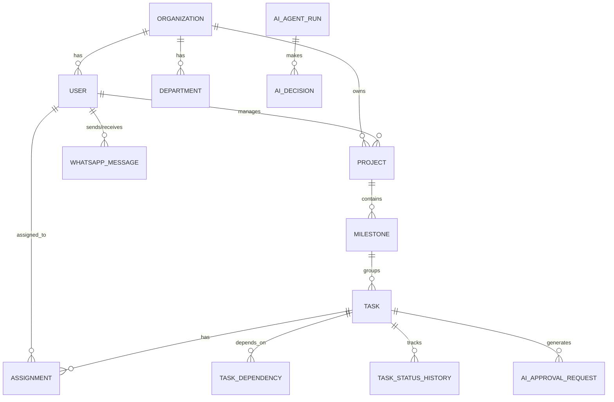

# Database Design Document: useAxiom

## 1. Database Architecture Overview
useAxiom relies on a **PostgreSQL** relational database. A relational model is chosen over NoSQL because the domain is highly structured and hierarchical (Organizations -> Projects -> Milestones -> Tasks). Enforcing referential integrity and strict multi-tenant isolation via relational constraints and Row-Level Security (RLS) is paramount for enterprise compliance.

The database is designed to handle high-velocity reads (Manager dashboards) and writes (AI event streams, WhatsApp webhooks). We utilize JSONB columns where schema flexibility is needed (e.g., AI reasoning metadata, webhook payloads), blending the benefits of relational and document stores.

## 2. Complete Entity List
### Core & Identity
- **Organization:** The root multi-tenant boundary.
- **Department:** Logical grouping within an organization.
- **User:** Individuals (Admins, Managers, Employees).
- **Role:** Access control mapping for Users.

### Project Execution
- **Project:** The high-level objective set by a Manager.
- **Milestone:** Distinct phases within a project.
- **Task:** The atomic unit of work generated by the AI or Manager.
- **TaskDependency:** Links indicating execution order (e.g., Task B requires Task A).
- **Assignment:** The mapping of a Task to a User.

### WhatsApp Communications
- **ConversationThread:** Groups messages by context/task.
- **WhatsAppMessage:** Individual inbound/outbound payloads.

### AI Engine & Audit
- **AIAgentRun:** Tracks an execution cycle of an AI Sub-Agent (Planner, Assigner).
- **AIDecision:** Logs specific choices made by the AI and their confidence scores.
- **AIApprovalRequest:** Tracks AI plans awaiting Manager approval.
- **AuditLog:** Immutable record of all system state changes.
- **TaskStatusHistory:** Time-series log of task progress for analytics.

## 3. ER Diagram (High-Level)

## 4. Table Specifications

### 4.1 `organizations`
- **Purpose:** Root entity for multi-tenancy.
- **Columns:** `id` (UUID, PK), `name` (VARCHAR, Not Null), `whatsapp_business_id` (VARCHAR), `created_at` (TIMESTAMP), `deleted_at` (TIMESTAMP, Nullable).
- **Constraints:** `id` unique.

### 4.2 `users`
- **Purpose:** System actors.
- **Columns:** `id` (UUID, PK), `organization_id` (UUID, FK), `department_id` (UUID, FK, Nullable), `role` (ENUM, Not Null), `name` (VARCHAR), `email` (VARCHAR, Nullable), `phone_number` (VARCHAR, Unique within Org), `created_at`, `deleted_at`.
- **Foreign Keys:** `organization_id` references `organizations.id` (CASCADE).

### 4.3 `projects`
- **Purpose:** High-level goals.
- **Columns:** `id` (UUID, PK), `organization_id` (UUID, FK), `manager_id` (UUID, FK), `name` (VARCHAR), `objective` (TEXT), `status` (ENUM), `target_deadline` (DATE), `created_at`, `deleted_at`.
- **Foreign Keys:** `manager_id` references `users.id` (SET NULL).

### 4.4 `tasks`
- **Purpose:** Executable work units.
- **Columns:** `id` (UUID, PK), `organization_id` (UUID, FK), `project_id` (UUID, FK), `milestone_id` (UUID, FK, Nullable), `title` (VARCHAR), `description` (TEXT), `status` (ENUM: `PROPOSED`, `PENDING`, `IN_PROGRESS`, `BLOCKED`, `COMPLETED`), `estimated_hours` (DECIMAL), `created_by_ai` (BOOLEAN), `created_at`, `deleted_at`.
- **Foreign Keys:** `project_id` references `projects.id` (CASCADE).

## 5. Relationships
- **Ownership (One-to-Many):** `organizations` own `projects`, `users`, and `audit_logs`. Cascade delete applies to organization deletion (rare). Project deletion cascades to `milestones` and `tasks`.
- **Assignments (Many-to-Many):** A `task` can have multiple `assignments` (Users), managed via the `assignments` junction table.
- **Dependencies (One-to-Many self-referencing):** `task_dependencies` links `task_id` (dependent) to `depends_on_task_id` (prerequisite). Restrict deletion if dependencies exist.

## 6. Indexing Strategy
- **Search:** GIN indexes on JSONB columns (e.g., AI reasoning metadata). Trigram indexes on `tasks.title` and `projects.name` for fast text search.
- **Filtering:** B-Tree indexes on `status`, `organization_id`, and `assignee_id` across primary tables.
- **Conversation Lookup:** Composite index on `whatsapp_messages(organization_id, user_id, created_at)` for rapidly retrieving chat history context for the AI.

## 7. Multi-Tenant Strategy
- **Isolation:** Every core table includes an `organization_id` column.
- **Security:** PostgreSQL Row-Level Security (RLS) policies will be globally applied using `current_setting('app.current_tenant_id')` to ensure queries cannot physically access data from another tenant, even if backend application code has a bug.

## 8. Audit Strategy
- **Table: `audit_logs`**
  - **Purpose:** Immutable record for compliance.
  - **Structure:** `id`, `organization_id`, `actor_id` (User or AI), `action` (e.g., `TASK_APPROVED`, `PROJECT_CREATED`), `entity_type`, `entity_id`, `previous_state` (JSONB), `new_state` (JSONB), `created_at`.
- **Table: `task_status_history`**
  - **Purpose:** Tracks task velocity. Logs timestamp when status shifts (e.g., PENDING -> IN_PROGRESS).

## 9. AI Data Model
- **Table: `ai_agent_runs`**
  - **Purpose:** Tracks an invocation of a sub-agent.
  - **Columns:** `id`, `agent_type` (`PLANNER`, `CONVERSATION`), `trigger_event`, `started_at`, `completed_at`, `status`.
- **Table: `ai_decisions`**
  - **Purpose:** Captures the AI's reasoning and confidence.
  - **Columns:** `run_id` (FK), `decision_type` (`ASSIGNMENT`, `INTENT_CLASSIFICATION`), `confidence_score` (DECIMAL 0-1), `reasoning_metadata` (JSONB - e.g., "Assigned to Alex due to 80% capacity").
- **Table: `ai_approval_requests`**
  - **Purpose:** Bridges the AI to the Manager for MVP "AI Assisted" mode.
  - **Columns:** `id`, `project_id`, `payload` (JSONB representing proposed tasks), `status` (`PENDING`, `APPROVED`, `REJECTED`), `manager_feedback` (TEXT).

## 10. WhatsApp Data Model
- **Table: `whatsapp_messages`**
  - **Purpose:** Raw storage of communications.
  - **Columns:** `id`, `organization_id`, `user_id` (Employee), `direction` (`INBOUND`, `OUTBOUND`), `meta_message_id` (VARCHAR for webhooks), `content` (TEXT), `delivery_status` (`SENT`, `DELIVERED`, `READ`, `FAILED`), `created_at`.
- **Table: `conversation_threads`**
  - **Purpose:** Links messages to a specific active task for contextual RAG memory.

## 11. Analytics Data Model
- Analytics are primarily derived from `task_status_history` and `ai_decisions`.
- **Materialized Views:** Used for dashboard speed. E.g., `mv_project_health` aggregating blocked tasks, completion velocity, and AI intervention counts per project. Refreshed asynchronously.

## 12. Soft Delete Strategy
- **Logical Deletion:** Implemented via a `deleted_at` TIMESTAMP column on all core entities (`organizations`, `users`, `projects`, `tasks`).
- **Retention:** Data is kept indefinitely in MVP. In future phases, records with `deleted_at > 90 days` can be archived to cold storage (e.g., AWS S3).
- **Recovery:** A simple `UPDATE ... SET deleted_at = NULL` restores data without breaking relational integrity.

## 13. Performance Considerations
- **High-Volume Notifications:** Webhooks insert directly into Redis queues first; database inserts occur asynchronously via workers to prevent DB connection exhaustion during message spikes.
- **Partitioning:** `audit_logs` and `whatsapp_messages` will be partitioned by month/year as organizations grow to millions of rows, ensuring index sizes remain manageable.

## 14. Security Considerations
- **Encryption:** `phone_number` and `email` fields can be hashed or encrypted at rest depending on strict PII compliance requirements.
- **API Keys:** Meta WhatsApp credentials and LLM API keys are never stored in this database; they reside in a secure external secrets manager (e.g., AWS Secrets Manager).

## 15. Future Scalability
The schema anticipates multi-platform integration:
- Addition of a `communication_channels` enum (Slack, Teams, SMS) on the `messages` table.
- A generic `external_references` JSONB column on tasks to natively link Jira Tickets or GitHub PRs without schema migrations.
