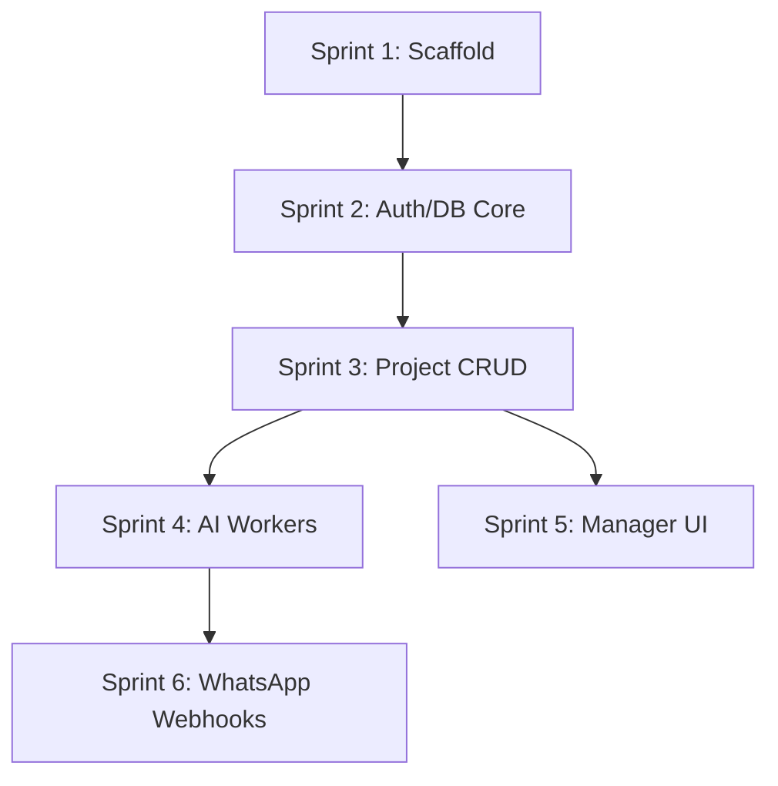

# Sprint Plan & Implementation Roadmap

## 1. Epics & Features Breakdown
- **Epic 1: Platform Foundation** (Monorepo, CI/CD, DB schemas, Core Auth)
- **Epic 2: Manager Dashboard** (UI framework, Project CRUD, Dashboard analytics)
- **Epic 3: AI Orchestration** (Task generation, Assignment recommendations)
- **Epic 4: Conversational Gateway** (WhatsApp webhooks, NLP intent classification)

## 2. Sprint Roadmap (To MVP)

### Sprint 1: Infrastructure & Scaffolding
- **Objective:** Establish the physical monorepo and deployable skeletons.
- **Deliverables:** Turborepo setup, ESLint/Prettier, Docker Compose (Postgres/Redis), empty backend/frontend apps.
- **Definition of Done:** `pnpm dev` successfully starts DB, Redis, API (returning 200 OK), and React app.

### Sprint 2: Core Data & Identity
- **Objective:** Multi-tenancy and Authentication.
- **Deliverables:** `users`, `organizations`, `roles` migrations. JWT login APIs. RBAC middleware.
- **Dependencies:** Sprint 1.

### Sprint 3: Execution Engine (CRUD)
- **Objective:** Project and Task state management.
- **Deliverables:** `projects`, `tasks`, `milestones` schemas and APIs. React UI for managing projects.
- **Dependencies:** Sprint 2.

### Sprint 4: AI Brain
- **Objective:** Connect the AI Orchestrator.
- **Deliverables:** BullMQ workers, LLM client integration, Planner Agent logic (Objective -> JSON Task list).
- **Dependencies:** Sprint 3.

### Sprint 5: WhatsApp Gateway
- **Objective:** Headless employee experience.
- **Deliverables:** Meta Webhook API, inbound message intent parsing, outbound notification engine.
- **Dependencies:** Sprint 4.

## 3. Dependency Graph

